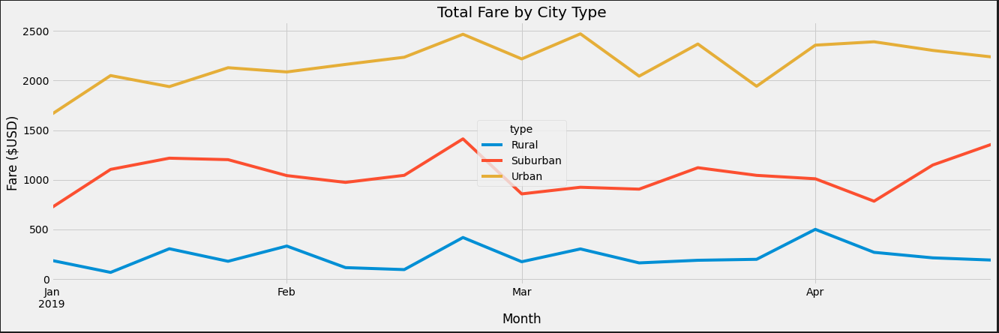
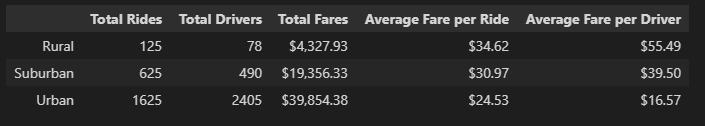

# PyBer_Analysis
UW Data Bootcamp - Module 5

The analysis should contain the following:

- **Overview of the analysis:**

    Using Pandas and Matplotlib libraries in Python develop a visualization for Pyber where the data is segregated by fare by different city types. Multiple hierarchies of data     is needed for the final analysis and following calculations needs to be performed in order for dataframe to be created:

  - Total no. of rides by city type

  - Total no. of drivers by city type

  - Sum of the fares by city type

  - Average fare per ride per city

  - Average fare per driver per city
 

- **Results:** 

    As they say a picture is worth a thousand words, the picture below shows total fare for each city type.  As expected there's a higher fare aggregate in Urban followed by         Suburban and Rural communities

  

  *** As the graph depicts the data is filtered on four months(2019-01-01 to 2019-04-29)*

- **Summary:** 

    The multiple-line chart talks about part of the storyline i.e. fare aggregate by city type. There's another side of the analysis which goes in the details of average cost of     the ride: 

  

    As seen from the above data frame the average fare in Rural communities is roughly four times higher than Urban, the total drivers in Urban is 3% of what we have in Urban
    The other area we should focus on is the density map, how many people live in a particular city type and how many of those own a car
    Lastly we also need to have a mechanism in place where we can look at profits
